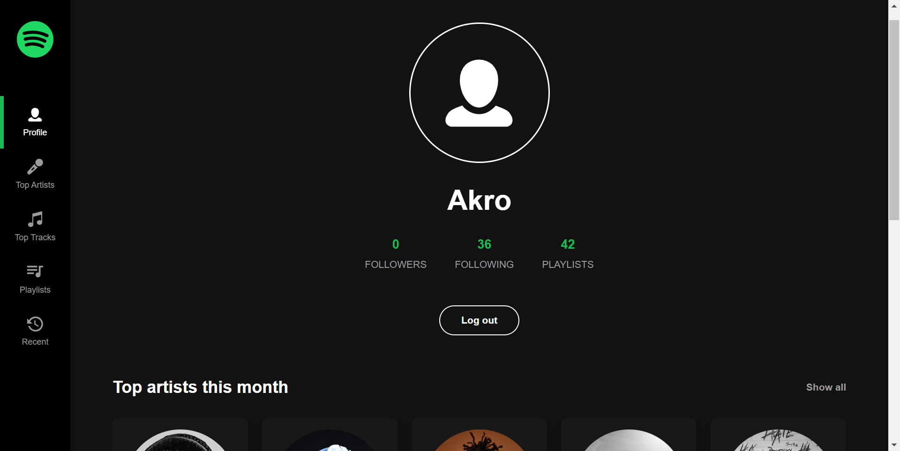
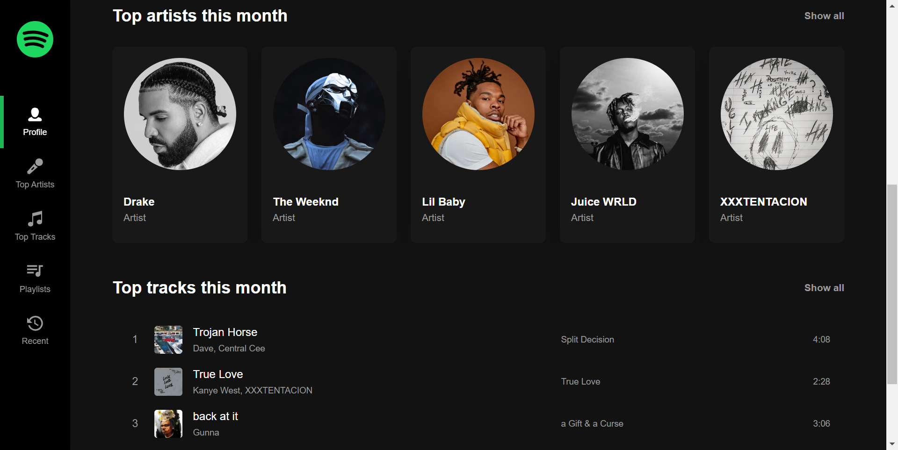

# Profile Spotify App

> [Demo](https://profile-spotify.netlify.app)

Embark on a tailored musical odyssey with the Spotify Profile App, granting you exclusive access to your Spotify data. This app introduces a suite of five features, beginning with a comprehensive Profile Overview. Here, you'll encounter a visual feast of your profile picture, follower counts, playlists, and a curated list of your most cherished tracks and artists.

Delve deeper into your musical preferences with the Top Listened Artists and Tracks features. Filter your favorite artists by date, ranging from the current month to your all-time classics. The immersive experience extends to your playlists, where you can effortlessly explore full tracklists with a single click.

Stay in tune with the rhythm of your present through the Recent Play History feature, offering real-time snapshots of your recently played tracks. Elevating the experience, the app allows you to enjoy a 30-second preview of any track, ensuring you're in sync with your musical mood.

Enhancing connectivity, the app facilitates a seamless transition to official Spotify artist profiles. A mere click on an artist redirects you to their authentic Spotify page, providing an enriched understanding of their musical world.

Beyond functionality, the app is a testament to design excellence, ensuring each interaction is a visually pleasing and intuitive journey. Immerse yourself in the Spotify Profile App — a convergence of design, data, and the delightful discovery of your unique musical universe.

## Technology Stack

The Profile Spotify App is built using the following technologies and tools:

- **TypeScript**: A typed superset of JavaScript that brings static typing to the language, enhancing code quality and developer productivity.
- **React**: A JavaScript library for building the user interface and managing the front-end.
- **React Query**: A JavaScript library used for simplified and efficient management of asynchronous data in React applications.
- **Sass**: A popular CSS extension language that enhances styling capabilities with features like variables and mixins.
- **npm**: The Node Package Manager for managing project dependencies.

## Features

1. **Profile Overview:**

   - Overview of the user's profile, including the total number of followers, following and playlists, it also includes a short list of the user's top tracks and artists.

2. **Top Listened Artists:**

   - List of the user's most listened artists across different timeframes.

3. **Top Listened Tracks:**

   - List of the user's most listened tracks across different timeframes.

4. **Playlists:**

   - List of the user's playlists where he can get the full tracklist of any playlist with a single click.

5. **Recent Played Tracks:**

   - List of the user's recently played tracks.

6. **Audio Previews:**

   -Preview any track with a 30-second snippet.

7. **Well-Designed User Interface:**

   - A user-friendly and aesthetically pleasing design for a positive user experience.

## Screenshots

### Home page

### Top artists page

### Top Tracks page

### playlists page

### Recent played tracks page

